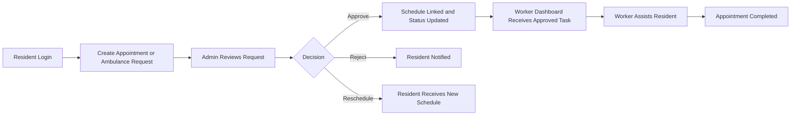
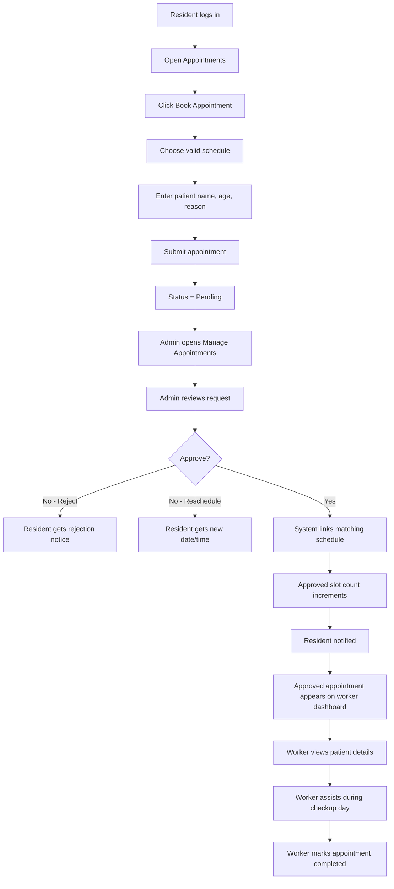
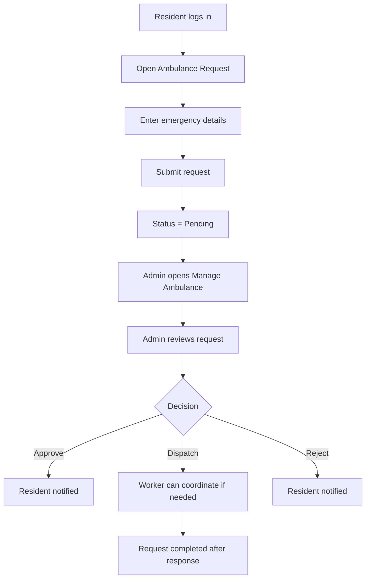
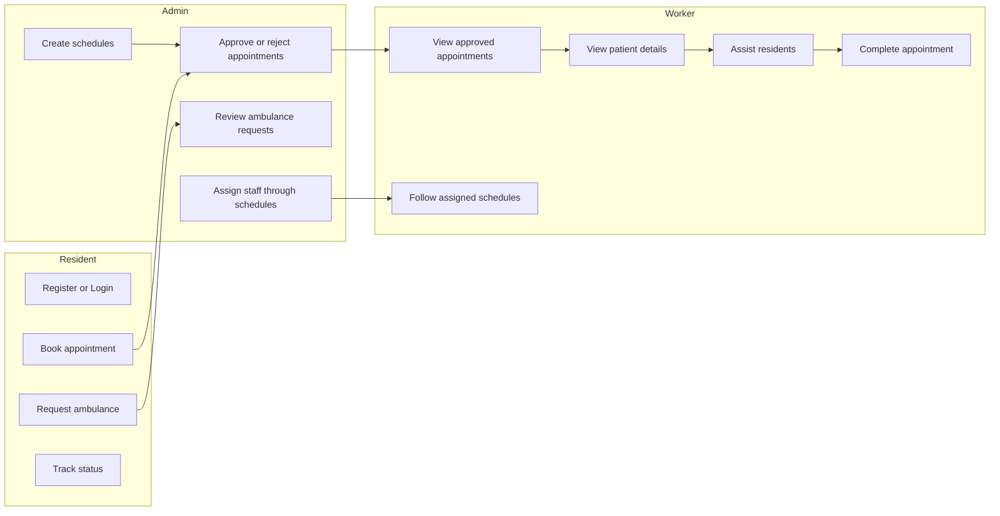

# BARAgo Health Appointment Management System

BARAgo is a full-stack health appointment management system designed for barangay healthcare operations. The application supports resident registration, appointment scheduling, ambulance assistance requests, administrative review workflows, health schedule management, notifications, and reporting.

## Overview

The system is organized as a TypeScript monorepo using npm workspaces. It includes a React frontend, an Express API server, shared OpenAPI-generated client packages, and a PostgreSQL database layer powered by Drizzle ORM.

The application supports three primary user roles:

- **Resident**: registers an account, submits health appointment requests, requests ambulance assistance, views notifications, and tracks request history.
- **Health Worker**: reviews approved appointments and records completion details.
- **Administrator**: manages residents, appointments, ambulance requests, health schedules, notifications, reports, and dashboard analytics.

## Features

- Resident account registration and authentication
- Role-based access control for residents, health workers, and administrators
- Appointment booking, review, approval, rejection, rescheduling, and completion
- Ambulance assistance request management
- Barangay health schedule management
- Resident verification and account status management
- In-app notifications
- Administrative dashboard and reports
- Shared API contracts through OpenAPI, Orval, and Zod
- PostgreSQL persistence using Drizzle ORM

## Workflow

### System Overview



### Appointment Workflow



### Ambulance Workflow



### Role Workflow



### Summary

1. Resident logs in and submits an appointment or ambulance request.
2. Admin reviews the request and either approves, rejects, or reschedules it.
3. Approved appointments are linked to schedules and counted against slots.
4. Approved appointments become visible to the assigned worker.
5. Worker handles the resident during the actual checkup or related task.

## Technology Stack

- **Frontend**: React 19, Vite, TypeScript, Tailwind CSS, shadcn/ui, Wouter, TanStack Query
- **Backend**: Node.js, Express 5, TypeScript, express-session
- **Database**: PostgreSQL, Drizzle ORM, drizzle-zod
- **API Contracts**: OpenAPI, Orval, Zod
- **Tooling**: npm workspaces, TypeScript project references, esbuild

## Project Structure

```text
.
├── artifacts/
│   ├── api-server/        # Express API server
│   ├── barago/            # React and Vite frontend application
│   └── mockup-sandbox/    # UI sandbox workspace
├── lib/
│   ├── api-client-react/  # Generated React Query API hooks
│   ├── api-spec/          # OpenAPI specification and code generation config
│   ├── api-zod/           # Generated Zod schemas
│   └── db/                # Drizzle schema, database client, and seed script
├── scripts/               # Workspace scripts
└── package.json           # Root workspace scripts and package configurations
```

## Prerequisites

Install the following before running the project:

- Node.js
- npm
- PostgreSQL database

## Environment Variables

Create the required environment configuration for local development before running the API server.

| Variable | Required | Description |
| --- | --- | --- |
| `DATABASE_URL` | Yes | PostgreSQL connection string used by Drizzle ORM |
| `PORT` | Yes | Port used by the API server, commonly `8080` in local development |
| `SESSION_SECRET` | Recommended | Secret used by `express-session`; a development fallback exists, but production should always provide a secure value |
| `LOG_LEVEL` | Optional | API logging level, such as `info` or `debug` |

## Installation

Install all workspace dependencies from the repository root:

```bash
npm install
```

## Database Setup

Push the Drizzle schema to the configured PostgreSQL database:

```bash
npm run push -w @workspace/db
```

Seed development data when needed:

```bash
npm run seed -w @workspace/db
```

## Development

Run the frontend and API server together:

```bash
npm run dev
```

Run the frontend only:

```bash
npm run dev -w @workspace/barago
```

Run the API server only:

```bash
npm run dev -w @workspace/api-server
```

## Build and Validation

Run TypeScript checks across the workspace:

```bash
npm run typecheck
```

Build all packages that provide a build script:

```bash
npm run build
```

Regenerate API clients and validation schemas after OpenAPI changes:

```bash
npm run codegen -w @workspace/api-spec
```

## Main Packages

### `artifacts/barago`

The primary frontend application. It contains the role-based user interface, page routing, shared layout components, forms, dashboard views, and API integration through generated React Query hooks.

### `artifacts/api-server`

The backend API server. It defines authentication, session handling, route middleware, resident management, appointment management, ambulance requests, schedules, notifications, dashboards, and reports.

### `lib/db`

The shared database package. It contains the Drizzle client, PostgreSQL schema definitions, exported table objects, and database utilities used by the API server.

### `lib/api-spec`, `lib/api-client-react`, and `lib/api-zod`

These packages maintain the contract between the backend and frontend. The OpenAPI specification is used to generate typed API clients and Zod validation schemas.

## Security Notes

- Production deployments should always provide a strong `SESSION_SECRET`.
- Database credentials should be stored in environment variables and must not be committed to the repository.
- Passwords are hashed before storage.
- Role-based route protection is enforced in the backend middleware and reflected in the frontend routing flow.

## License

This project is licensed under the MIT License.
