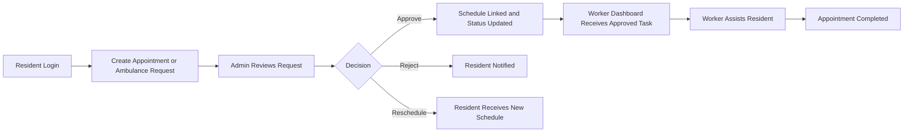
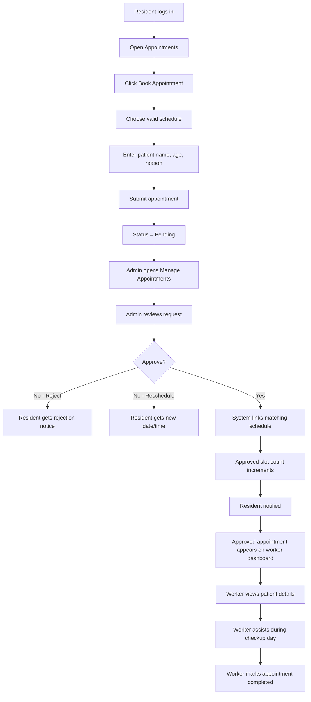
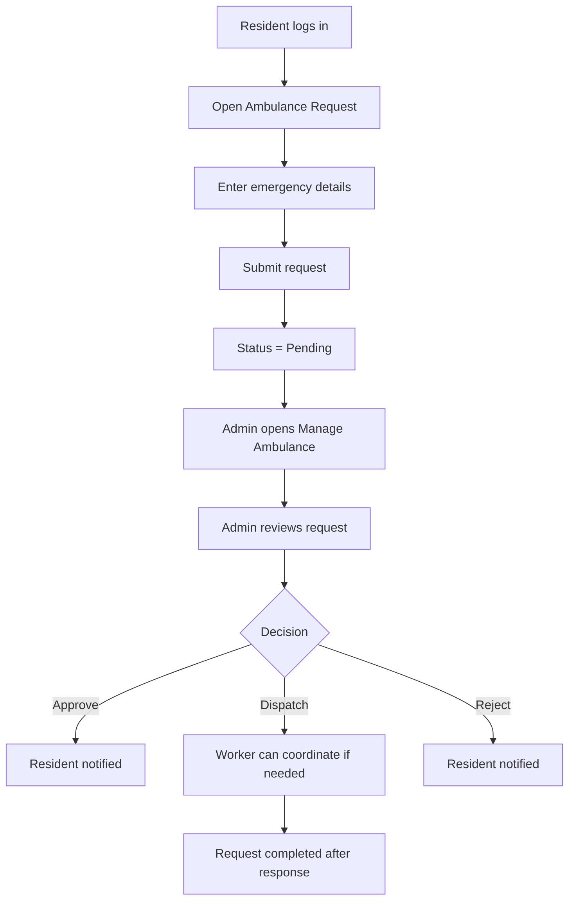
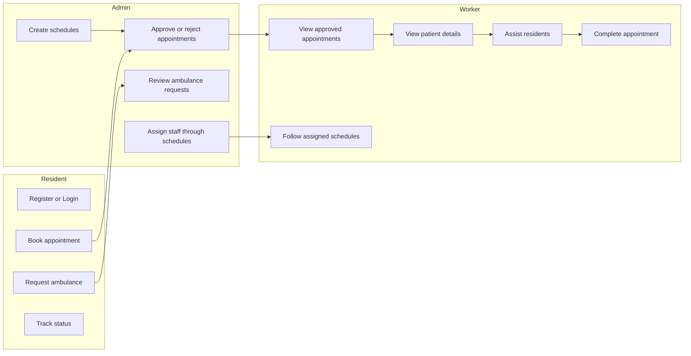

# BaraGo System Workflow

This document describes the expected flow of the BaraGo Healthcare Scheduling Management System, with visual diagrams for residents, admins, and workers.

## System Overview

## Appointment Workflow

## Ambulance Workflow

## Role Workflow

## Resident Flow

1. Resident opens the landing page.
2. Resident logs in or registers.
3. Resident opens the appointment or ambulance request module.
4. Resident submits a request.
5. Resident monitors the status from the dashboard.

## Admin Flow

1. Admin logs in to `/admin`.
2. Admin creates health schedules first.
3. Admin reviews pending appointments and ambulance requests.
4. Admin approves, rejects, or reschedules requests.
5. Approved appointments are linked to schedules and counted against slots.

## Worker Flow

1. Worker logs in to `/health-worker`.
2. Worker views approved appointments sent after admin approval.
3. Worker checks patient details, schedule details, and active tasks.
4. Worker assists the resident during checkup day.
5. Worker marks the appointment as completed when finished.

## Business Rules

- Appointments cannot be booked for past dates.
- Appointments must be scheduled at least 2 days ahead.
- Only open schedules with remaining slots can be selected.
- Approved appointments increment the slot count of the linked schedule.
- Worker visibility starts only after admin approval.

## End-to-End Example

1. Resident logs in.
2. Resident books an appointment from an available schedule.
3. Appointment is saved as `pending`.
4. Admin logs in and reviews the request.
5. Admin approves the appointment.
6. The system links the appointment to the correct schedule.
7. The approved schedule slot count increases.
8. The resident receives a status update.
9. The approved appointment appears on the worker dashboard.
10. The worker views the patient and handles the checkup.
